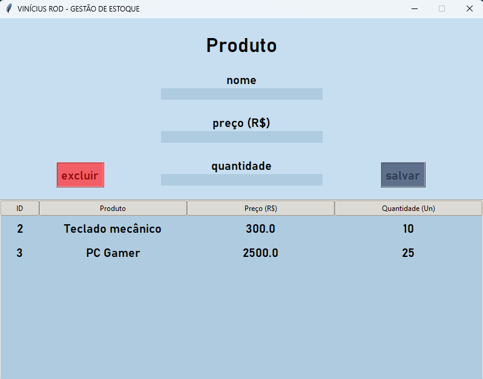

# 📦 Sistema de Gestão de Estoque

Um aplicativo desktop intuitivo para gerenciamento de estoque com interface gráfica em Python, desenvolvido como projeto da Estácio.

## � Screenshots



## 🎯 Sobre o Projeto

Este sistema oferece uma solução completa para gerenciar produtos em estoque, permitindo adicionar, editar, visualizar e remover itens de forma simples e eficiente. A aplicação utiliza banco de dados SQLite para persistência de dados e registra todas as operações em logs detalhados.

## ✨ Funcionalidades

- **Cadastrar Produtos**: Adicione novos produtos informando nome, preço e quantidade
- **Visualizar Estoque**: Veja todos os produtos em uma tabela organizada com ID, nome, preço e quantidade
- **Editar Produtos**: Clique duas vezes em um produto para editar seus dados
- **Excluir Produtos**: Remova produtos do estoque com confirmação de segurança
- **Sistema de Logs**: Todas as operações são registradas em `log_estoque.txt` com data, hora e detalhes
- **Interface Amigável**: Design limpo com cores personalizadas e navegação intuitiva

## 🛠️ Tecnologias Utilizadas

- **Python 3**
- **Tkinter** - Framework para criação de interface gráfica
- **SQLite3** - Banco de dados embutido
- **Datetime** - Para registro de timestamps nas operações

## 📂 Estrutura do Projeto

```
├── script.py                    # Arquivo principal da aplicação
├── log_estoque.txt             # Arquivo de logs das operações
└── estoque_produtos.db         # Banco de dados SQLite (criado automaticamente)
```

## 🚀 Como Executar

1. Certifique-se de ter Python 3 instalado em sua máquina
2. Clone ou baixe este repositório
3. Navegue até a pasta do projeto
4. Execute o comando:

```bash
python script.py
```

A janela da aplicação será aberta automaticamente e centralizada na sua tela.

## 📋 Como Usar

### Adicionar um Produto
1. Preencha os campos: **Nome**, **Preço (R$)** e **Quantidade**
2. Clique no botão **"Salvar"**
3. O produto aparecerá na tabela e será registrado no log

### Editar um Produto
1. Clique duas vezes no produto que deseja editar na tabela
2. Confirme a ação no diálogo que aparecer
3. Os dados do produto aparecerão nos campos de entrada
4. Faça as alterações necessárias
5. Clique em **"Atualizar"** para salvar
6. Clique em **"Cancelar"** se desejar descartar as alterações

### Deletar um Produto
1. Selecione um produto na tabela
2. Clique no botão **"Excluir"**
3. Confirme a exclusão no diálogo
4. O produto será removido e a operação será registrada no log

## �📝 Arquivo de Logs

O arquivo `log_estoque.txt` mantém um histórico detalhado de todas as operações:

```
[30/05/2026 21:54:54] INSERÇÃO - Produto "PC Gamer" (Qtd: 20.0) cadastrado com sucesso.
[30/05/2026 21:55:38] ATUALIZAÇÃO - Produto "PC" alterado para "PC Intel I5" (Nova Qtd: 25.0, Novo Preço: 3000.0).
[31/05/2026 00:08:26] EXCLUSÃO - Produto "PC Intel" removido do sistema.
```

## 🎨 Design

A interface utiliza um esquema de cores personalizadas:
- **Fundo Principal**: Azul claro (#C6DEEF)
- **Campos de Entrada**: Azul suave (#AECBE0)
- **Botões Neutros**: Cinza (#5E708B)
- **Botão Deletar**: Vermelho (#F25E65)
- **Botão Atualizar**: Amarelo (#f2c772)

## 👨‍💻 Autor

**Antonio Vinicius Rodrigues**  
LinkedIn: [viniciusrodmusic](https://linkedin.com/in/viniciusrodmusic/)

---

> **Nota**: Esta documentação foi gerada com assistência de IA para melhorar a clareza e completude do projeto. 🤖
